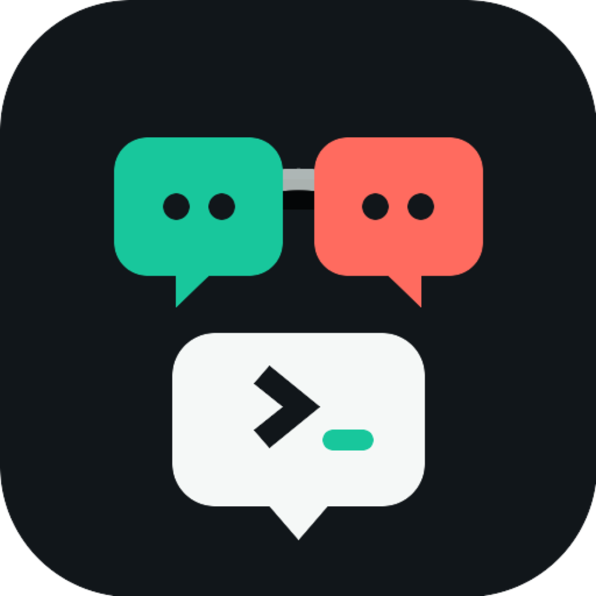
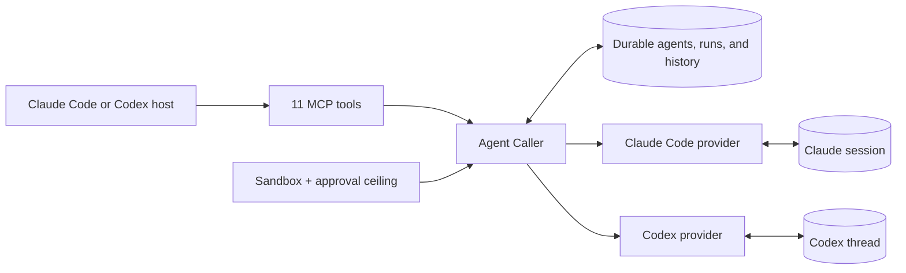

<p align="center">
  
</p>

<h1 align="center">Agent Caller</h1>

<p align="center"><strong>A plugin that lets coding agents call one another as durable, recoverable sub-agents.</strong></p>

Agent Caller lets Claude Code, Codex, and other MCP-compatible coding agents
call one another as durable, recoverable sub-agents. Claude Code and Codex are
the built-in hosts and providers today; the shared MCP lifecycle is designed to
extend to more coding agents. Each agent keeps a stable identity, role,
provider conversation, and local history across messages, provider process
exits, and host restarts.

> **Latest: v0.2.0** — Claude Code is now a first-class host alongside Codex,
> sharing the same agents and state. A durable agent can also select
> `trusted`, `guarded`, or `observer` per run without losing its conversation;
> omitting the run profile returns to the agent's default.

## Why

Claude Code and Codex already have capable native agent systems: you can watch
them work, assign roles, organize a team, and approve their actions. Agent Caller
does not replace those systems. It adds a cross-provider orchestration layer
where three properties become first-class:

- **Recoverable conversations.** Native sub-agents are tied to their hosting
  task. Once a member is released or the host process exits, the coordinator
  does not retain a durable member it can address later. Agent Caller persists
  the agent identity and provider recovery handle, so the next message continues
  the same conversation, role, and history.
- **Codex and Claude Code in both directions, from either host.** Either host
  can delegate to either provider: a Codex host can ask a Claude reviewer for an
  independent second opinion; a Claude Code host can spin up a Codex
  implementer; either can coordinate a mixed-provider team.
- **A unified authority model.** Every run selects an explicit sandbox and
  approval profile instead of inheriting the parent host session's authority.
  The same durable agent may change profile between turns without losing its
  conversation. Claude Code and Codex requests are exposed and recorded through
  the same interface; interrupted requests expire safely and are never silently
  approved or replayed.

Together, these make Agent Caller a **cross-provider, recoverable, and
permission-controlled sub-agent orchestration layer**.

## Hosts And Providers

Agent Caller separates the **host** (the session that loads the plugin and
calls the tools) from the **provider** (the engine that backs each agent).

| | Can be a Host | Can be a Provider |
|---|---|---|
| Claude Code | Yes | Yes |
| Codex | Yes | Yes |

Any host can drive any provider. A Claude Code host can run a Claude Code
reviewer, a Codex implementer, or both; a Codex host can do the same in reverse.
A Claude Code provider agent is always an independent process and context, never
the host session itself.

## Quick Start

Requirements: Node.js 22 or newer, plus the CLI for each host/provider you want
to use — a current Codex CLI (with Plugin and App Server support) and/or a
current Claude Code CLI. One plugin install serves a host; both hosts can share
the same clone.

The Codex host and the Claude Code host use separate, official plugin systems,
so each has its own two-line install. Both load the same plugin directory, the
same MCP server, and the same durable state.

### Codex Host

```bash
git clone https://github.com/Johnny-xuan/Agent-Caller.git
cd Agent-Caller
codex plugin marketplace add "$PWD"
codex plugin add agent-caller@agent-caller
```

Codex marketplace manifest:
[`.agents/plugins/marketplace.json`](./.agents/plugins/marketplace.json). MCP
config: [`plugins/agent-caller/.mcp.json`](./plugins/agent-caller/.mcp.json).

### Claude Code Host

```bash
git clone https://github.com/Johnny-xuan/Agent-Caller.git
cd Agent-Caller
claude plugin marketplace add "$PWD"
claude plugin install agent-caller@agent-caller
```

Claude marketplace manifest:
[`.claude-plugin/marketplace.json`](./.claude-plugin/marketplace.json). MCP
config: [`plugins/agent-caller/.mcp.claude.json`](./plugins/agent-caller/.mcp.claude.json),
which locates the server via `${CLAUDE_PLUGIN_ROOT}` as Claude Code requires.

### Verify

```bash
npm --prefix plugins/agent-caller ci --omit=optional
npm --prefix plugins/agent-caller run doctor
codex plugin list     # Codex host
claude plugin list    # Claude Code host
claude mcp list       # should show plugin:agent-caller:agent-caller -> Connected
```

`doctor` checks Node.js, Claude Code, Codex, and Codex App Server availability.
The plugin also installs its locked runtime dependencies automatically on first
start.

### Try It

Plugins and MCP tools do not hot-load into an existing session. Start a new
Codex task or Claude Code session, then say:

```text
Use Agent Caller. List the Claude Code and Codex models available in this
workspace, ask me which model and effort to use, then create an architect and a
reviewer to analyze this project.
```

On first use of each provider in a session, Agent Caller reads its live model
catalog and asks you to choose the model and reasoning effort.

<details>
<summary><strong>Install with a Coding Agent</strong></summary>

Give either prompt to Codex, Claude Code, or another coding agent that can run
terminal commands. The two prompts install for different hosts; both can run on
the same clone.

Claude Code host:

```text
Install Agent Caller for my Claude Code host and verify it end to end.

Repository: https://github.com/Johnny-xuan/Agent-Caller
Plugin: agent-caller@agent-caller

Do the work instead of only describing commands:

1. Check Node.js and npm. Node.js must be 22 or newer.
2. Check whether the Claude Code CLI and the Codex CLI are installed. Report
   their executable paths and current versions. Look up the latest stable
   versions from the official Anthropic and OpenAI release channels. If either
   CLI is missing or outdated, show me the official install or update command
   and ask before changing it. Preserve my existing package manager and
   configuration.
3. Clone the repository into a stable local directory, or update the existing
   clone after confirming it is the same repository.
4. Run:
   npm --prefix plugins/agent-caller ci --omit=optional
   npm --prefix plugins/agent-caller run doctor
   Diagnose real failures instead of claiming success.
5. Register the repository root as a local Claude Code marketplace with
   `claude plugin marketplace add <repo-root>` if the `agent-caller` marketplace
   is absent. Do not remove or overwrite unrelated marketplaces.
6. Install with `claude plugin install agent-caller@agent-caller`, then verify
   the installed and enabled result with `claude plugin list`.
7. Confirm the MCP server loads by running `claude mcp list`; the
   `plugin:agent-caller:agent-caller` server must show Connected. Explain that
   the plugin and its MCP server load only in a new Claude Code session (or via
   /reload-plugins), so a fresh session is required before the tools appear.
8. Tell me that the first use of each provider should call `list_models` and ask
   me to choose model and effort.
9. Give me one ready-to-use prompt that, in a new Claude Code session, lists the
   Claude Code and Codex models in this workspace and creates a durable agent
   team, then report every command you ran and the final installed version.
```

Codex host:

```text
Install Agent Caller for my local Codex and verify it end to end.

Repository: https://github.com/Johnny-xuan/Agent-Caller
Plugin: agent-caller@agent-caller

Do the work instead of only describing commands:

1. Check Node.js and npm. Node.js must be 22 or newer.
2. Check whether both Codex CLI and Claude Code CLI are installed. Report their
   executable paths and current versions. Look up the latest stable versions
   from the official OpenAI and Anthropic release channels. If either CLI is
   missing or outdated, show me the official install or update command and ask
   before changing it. Preserve my existing package manager and configuration.
3. Clone the repository into a stable local directory, or update the existing
   clone after confirming it is the same repository.
4. Run:
   npm --prefix plugins/agent-caller ci --omit=optional
   npm --prefix plugins/agent-caller run doctor
   Diagnose real failures instead of claiming success.
5. Inspect `codex plugin marketplace list`. Register the repository root as a
   local marketplace with `codex plugin marketplace add <repo-root>` if the
   `agent-caller` marketplace is absent. Do not remove or overwrite unrelated
   marketplaces.
6. Install with `codex plugin add agent-caller@agent-caller`, then verify
   the installed and enabled result with `codex plugin list`.
7. Explain that the plugin loads only in a new Codex task. Tell me that the first
   use of each provider should call `list_models` and ask me to choose model
   and effort.
8. Give me one ready-to-use prompt that creates a Claude Code reviewer and a
   Codex implementer in my current workspace, then report every command you ran
   and the final installed version.
```

</details>

## How It Works



The host addresses agents by a stable Agent Caller name or ID. Provider session
and thread identifiers remain internal recovery handles.

| Area | MCP tools |
|---|---|
| Create and communicate | `create_agent`, `send_message`, `respond_to_request` |
| Inspect | `get_agent`, `get_history`, `list_agents`, `list_models` |
| Lifecycle | `release_agent`, `stop_run`, `resume_agent`, `delete_agent` |

Claude Code conversations use the Claude Agent SDK when available, with a CLI
fallback for compatible non-interactive work. Codex conversations use Codex App
Server v2. Different agents can run in parallel; each agent accepts one
conversation-mutating run at a time.

## Authority Profiles

| Profile | Sandbox | Approval | Use |
|---|---|---|---|
| `trusted` | `danger_full_access` | `autonomous` | Normal local coding; default |
| `guarded` | `workspace_write` | `on_request` | Explicitly supervised or high-impact work |
| `observer` | `read_only` | `fail_closed` | Strict local inspection with reduced tools |

The profile selected at creation is the agent's default. `send_message` may
select another profile for one run; omitting it on the next turn returns to the
agent default. A profile cannot change while a run is already active.

Profiles are optional advanced controls. Ordinary delegation defaults to
`trusted`, including review and web research; Agent Caller does not infer a
narrower profile from the task label alone. Use `guarded` or `observer` only
when the user explicitly wants containment or after an explicit authority
decision for high-impact work.

`trusted` removes routine approval interruptions, while a shared delegation
prompt still limits both providers to the assigned work. That prompt is a
behavioral contract, not a security boundary. Use `guarded` or `observer` when
technical containment is required.

## Documentation

Product behavior:

- [Product contract](./references/product-contract.md)
- [Supervised execution and approval mapping](./references/supervised-execution.md)
- [Claude Code Host integration](./references/claude-code-host.md)

Agent and operator references:

- [MCP tools](./plugins/agent-caller/skills/agent-caller/references/tools.md)
- [Lifecycle and recovery](./plugins/agent-caller/skills/agent-caller/references/lifecycle.md)
- [Permissions and requests](./plugins/agent-caller/skills/agent-caller/references/permissions.md)
- [Models and reasoning effort](./plugins/agent-caller/skills/agent-caller/references/models-and-effort.md)
- [Project and global scopes](./plugins/agent-caller/skills/agent-caller/references/scopes.md)
- [Provider behavior](./plugins/agent-caller/skills/agent-caller/references/providers.md)
- [Troubleshooting](./plugins/agent-caller/skills/agent-caller/references/troubleshooting.md)

## Local Development

```bash
cd plugins/agent-caller
npm ci --omit=optional
npm test
npm run doctor
```

Runtime state defaults to `~/.codex/agent-caller`. Set
`AGENT_CALLER_DATA_DIR` to use an isolated development or test store.
