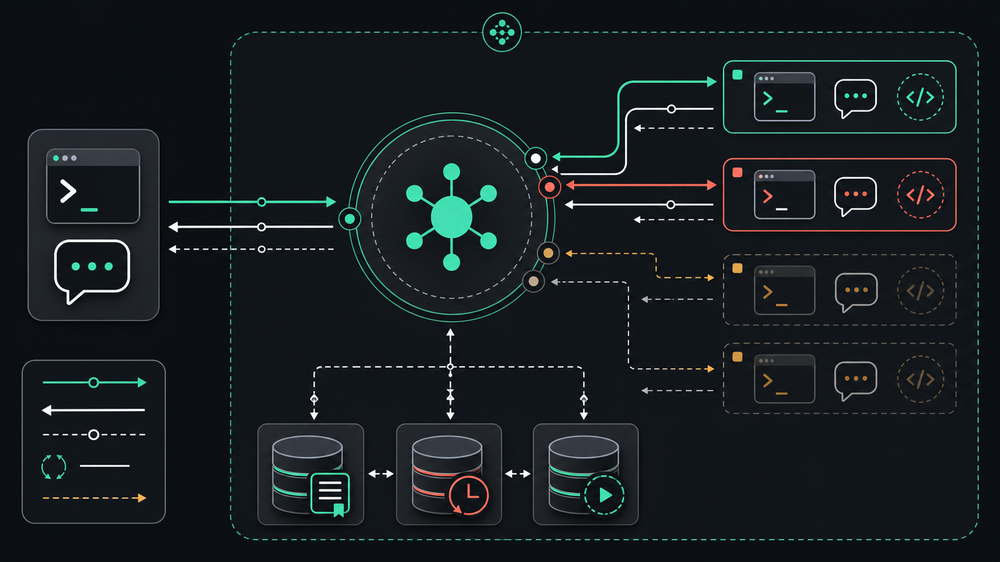
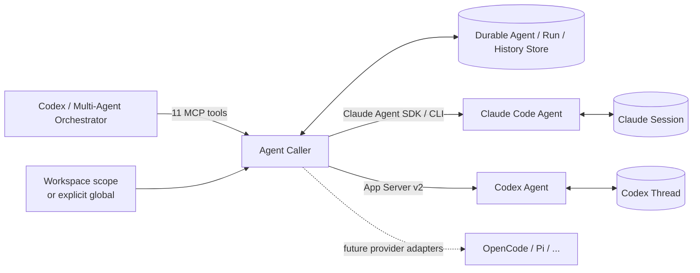

<p align="center">
  
</p>

<h1 align="center">Agent Caller</h1>

<p align="center">让 Codex 调用并管理可持续协作的 Claude Code 与 Codex 子 Agent。</p>

Agent Caller 不是一次性执行 `claude -p` 或 `codex exec` 的命令包装。它为
Codex 提供一组原生 MCP 工具，用来创建有名字、有角色、有独立上下文的团队成员，
并在多轮对话、进程退出和 Codex 重启后继续使用同一个 Agent。

## 为什么需要 Agent Caller

不同 Coding Agent 有不同的优势：有的更擅长长上下文分析，有的更适合快速实现、
代码 Review、工具调用或反方审查，但它们通常被各自的 CLI、会话格式和生命周期
隔开，难以成为同一个团队里的成员。

Agent Caller 在这些 Provider 之上提供统一的 Durable Agent 协议：角色、模型、
权限、消息、状态、历史、停止与恢复都使用同一套接口。Codex 或其他 Multi-Agent
编排逻辑只需要面向 Agent Caller 分配工作，不必为每个底层 Agent 重写调用流程。

当前版本已经实现 Claude Code 和 Codex Provider。Provider 层可以继续扩展到
OpenCode、Pi 等 Agent；这些属于后续扩展方向，不代表当前版本已经内置。

## 调用架构

<p align="center">
  
</p>



Codex 负责组建团队、定义角色和综合结论；Agent Caller 负责统一不同 Provider 的
调用与生命周期；每个 Agent 保留自己的原生上下文，可以并行工作，也可以在之后
继续同一段多轮对话。这套结构既能作为更强的 sub-agent 工具，也能成为
Multi-Agent 编排中的 Provider 层。

## 能做什么

- 同时创建 Claude Code 和 Codex Agent，并为每个成员定义角色。
- 与同一个 Agent 持续多轮对话，保留原生 Claude Session 或 Codex Thread。
- 并行分配任务，查看状态、最近输出、历史和待处理请求。
- 停止当前 Run、释放空闲 Agent，并在之后恢复，而不丢失上下文。
- 从 Provider 的实时配置中发现模型与思考强度。
- 在 `trusted`、`guarded` 和 `observer` 三种权限档位之间选择。
- 默认按照当前打开的 Workspace 隔离 Agent，显式使用 `global` 才跨 Workspace。

## 交给 Coding Agent 安装（推荐）

把下面整段 Prompt 发给 Claude Code、Codex 或其他能够执行终端命令的 Coding
Agent。它会负责下载、安装、验证，并在完成后告诉你如何开始使用，而不是只把命令
重新念一遍。

```text
请帮我把 Agent Caller 安装到本机 Codex，并在安装完成后指导我使用。

项目地址：https://github.com/Johnny-xuan/Agent-Caller
目标插件：agent-caller@agent-caller

请实际执行安装和验证，不要只向我复述命令。按照下面流程进行：

1. 检查 `node --version` 和 `npm --version`，确认 Node.js 至少为 22。

2. 必须分别检查 Codex CLI 和 Claude Code CLI：
   - 使用 `command -v codex` 与 `codex --version` 检查 Codex 是否安装及当前版本；
   - 使用 `command -v claude` 与 `claude --version` 检查 Claude Code 是否安装及当前版本；
   - 从 OpenAI 和 Anthropic 的官方发布渠道查询两者此刻的最新稳定版本，不要使用
     README 中硬编码的版本，也不要把“命令能够运行”当成“已经是最新版”；
   - 明确报告每个 CLI 的安装路径、当前版本、官方最新版本以及是否需要更新。

3. 如果 Codex 或 Claude Code 缺失、版本过旧，先识别它原来的安装方式，再向我说明
   准备采用的官方安装或更新命令，并在得到我确认后执行。不要擅自切换包管理器，
   不要使用非官方镜像。更新完成后重新运行 `codex --version` 和 `claude --version`
   验证。Agent Caller 需要支持 `codex plugin` 和 App Server 的 Codex；如果我选择
   暂不安装 Claude Code，可以继续安装插件，但必须说明 Claude Provider 暂不可用。

4. 下载并注册 Git Marketplace：
   - 如果还没有名为 `agent-caller` 的 Marketplace，执行
     `codex plugin marketplace add Johnny-xuan/Agent-Caller --ref main`。
   - 如果已经存在，执行 `codex plugin marketplace upgrade agent-caller`。
   - 不要删除或覆盖其他 Marketplace、插件或用户配置。

5. 执行 `codex plugin add agent-caller@agent-caller` 安装插件。

6. 执行 `codex plugin list` 验证结果。确认 `agent-caller@agent-caller` 显示为
   installed 且 enabled；如果失败，请读取真实错误、排查并重试一次，不要在没有
   验证的情况下声称安装成功。

7. 说明新安装的 Plugin 和 MCP 工具不会热加载到当前 Codex 对话。安装成功后，
   明确让我新建一个 Codex 任务。如果你当前是 Claude Code 或其他 Coding Agent，
   也要说明这个插件最终是在 Codex 中使用，而不是安装进当前 Agent 自己。

8. 安装结束后，用简短中文告诉我：
   - Agent Caller 能创建 Claude Code 或 Codex 驱动的持久 Agent；
   - 同一个 Agent 可以多轮对话、停止、释放和恢复；
   - 默认 `scope=project` 按我实际打开的 Workspace 路径隔离，跨 Workspace 只有
     显式 `global`；
   - `trusted` 适合日常自主开发，`guarded` 会请求审批，`observer` 只读；
   - 第一次使用某个 Provider 时应该先调用 `list_models`，让我选择模型和思考强度。

9. 最后给我下面三个可以在新 Codex 任务里直接说的示例：
   - 查看 Claude Code 和 Codex 的可用模型，询问我选择模型与思考强度，然后创建
     architect 和 reviewer 两个 Agent 分析当前项目。
   - 列出当前 Workspace 的 Agent，查看 architect 的最新状态和输出。
   - 恢复 reviewer，继续追问上一轮 Review 中最严重的问题。

完成后报告实际执行结果、安装到的插件版本，以及我下一步需要打开的新 Codex 任务。
```

Marketplace 注册本身就会从 GitHub 下载插件，不需要先手动 `git clone`。

## 手动安装

要求：

- Node.js 22 或更高版本，以及 npm；
- 支持 Plugin 和 App Server 的 Codex CLI/App；
- 使用 Claude Code Provider 时，需要本机已安装并配置 Claude Code。

添加 Marketplace 并安装插件：

```bash
codex plugin marketplace add Johnny-xuan/Agent-Caller
codex plugin add agent-caller@agent-caller
```

安装完成后新建一个 Codex 任务，让 Codex 加载新的 Skill 和 MCP 工具。
插件首次启动会通过 npm 安装 Claude Agent SDK 的 JavaScript 运行依赖，不会下载
SDK 自带的可选 Claude 二进制；Claude Provider 使用用户本机的 `claude` 命令。

## 开始使用

可以直接对 Codex 说：

```text
查看当前 Claude Code 和 Codex 可以使用的模型，询问我选择哪个模型和思考强度，
然后创建 architect 和 reviewer 两个 Agent 来分析这个项目。
```

也可以继续已有成员：

```text
列出这个 Workspace 里的 Agent，恢复 architect，然后追问它上一轮方案里的风险。
```

第一次在当前 Codex 任务中使用某个 Provider 时，Agent Caller 会先读取实时模型
列表，并让你确认模型和思考强度。选择会在当前任务和 Workspace 中复用。

## Workspace 与 Global

`scope=project` 是默认值；这里的 `project` 指用户实际打开的 Workspace 路径，
与是否存在 Git 仓库无关。

- 同一个 Workspace 中的不同 Codex 任务可以看到并继续使用相同 Agent。
- 另一个 Workspace 默认看不到这些 Agent。
- 分别打开的父目录和子目录是两个 Workspace。
- `scope=global` 必须显式指定，适合真正需要跨 Workspace 共享的成员。

Workspace Scope 只控制 Agent 的可见性。Claude Code 与 Codex 仍然使用用户原有的
配置、认证、Skills、插件和 MCP Server。

## 权限档位

| Profile | Sandbox | Approval | 适用场景 |
|---|---|---|---|
| `trusted` | Full access | Autonomous | 日常本地开发，默认值 |
| `guarded` | Workspace write | On request | 允许写入，但关键操作需要确认 |
| `observer` | Read only | Fail closed | 只读探索、Review 和分析 |

`trusted` 会减少频繁审批，但仍通过强约束 Prompt 限定任务边界。Prompt 不是安全
边界；需要技术隔离时应使用 `guarded` 或 `observer`。

## MCP 工具

插件提供 11 个工具：

| 类别 | 工具 |
|---|---|
| 创建与沟通 | `create_agent`, `send_message`, `respond_to_request` |
| 查看 | `get_agent`, `get_history`, `list_agents`, `list_models` |
| 生命周期 | `release_agent`, `stop_run`, `resume_agent`, `delete_agent` |

Agent 默认状态保存在 `~/.codex/agent-caller`。可以通过
`AGENT_CALLER_DATA_DIR` 指定其他位置。

## 更新

```bash
codex plugin marketplace upgrade agent-caller
codex plugin add agent-caller@agent-caller
```

更新后新建一个 Codex 任务以加载新版本。
