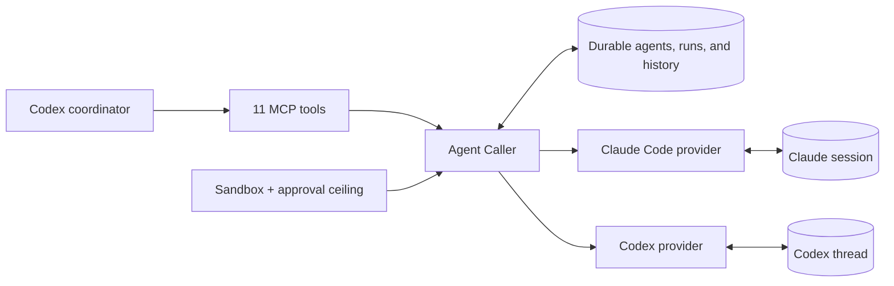

<p align="center">
  
</p>

<h1 align="center">Agent Caller</h1>

<p align="center"><strong>Durable, cross-provider sub-agents for Codex.</strong></p>

Agent Caller lets Codex coordinate Claude Code and Codex agents through one
recoverable lifecycle and one authority model. Each agent keeps a stable
identity, role, provider conversation, and local history across messages,
provider process exits, and Codex restarts.

## Why

Codex already has capable native sub-agents: you can watch them work, assign
roles, organize a team, and approve their actions. Agent Caller does not replace
that system. It adds a cross-provider orchestration layer where three properties
become first-class:

- **Recoverable conversations.** Native sub-agents are tied to their hosting
  task. Once a member is released or the host process exits, the coordinator
  does not retain a durable member it can address later. Agent Caller persists
  the agent identity and provider recovery handle, so the next message continues
  the same conversation, role, and history.
- **Codex and Claude Code in both directions.** The official bridge covers
  calling Codex from Claude Code. Agent Caller gives Codex the other direction:
  it can delegate to a Claude reviewer, ask for an independent second opinion,
  or coordinate a mixed-provider team.
- **A stricter, unified authority model.** Every agent has its own sandbox and
  approval ceiling instead of inheriting the parent Codex task's authority. A
  run may narrow that policy but can never widen it. Claude Code and Codex
  requests are exposed and recorded through the same interface; interrupted
  requests expire safely and are never silently approved or replayed.

Together, these make Agent Caller a **cross-provider, recoverable, and
permission-controlled sub-agent orchestration layer**.

## Quick Start

Requirements: Node.js 22 or newer, a current Codex CLI with Plugin and App
Server support, and Claude Code CLI when using the Claude provider.

### 1. Install

Clone the repository, register its local marketplace, and install the plugin:

```bash
git clone https://github.com/Johnny-xuan/Agent-Caller.git
cd Agent-Caller
codex plugin marketplace add "$PWD"
codex plugin add agent-caller@agent-caller
```

The marketplace manifest is
[`.agents/plugins/marketplace.json`](./.agents/plugins/marketplace.json).

### 2. Verify

```bash
npm --prefix plugins/agent-caller ci --omit=optional
npm --prefix plugins/agent-caller run doctor
codex plugin list
```

`doctor` checks Node.js, Claude Code, Codex, and Codex App Server availability.
The plugin also installs its locked runtime dependencies automatically on first
start.

### 3. Try It

Plugins and MCP tools do not hot-load into an existing task. Start a new Codex
task, then say:

```text
Use Agent Caller. List the Claude Code and Codex models available in this
workspace, ask me which model and effort to use, then create an architect and a
reviewer to analyze this project.
```

On first use of each provider in a task, Agent Caller reads its live model
catalog and asks you to choose the model and reasoning effort.

<details>
<summary><strong>Install with a Coding Agent</strong></summary>

Give the following prompt to Codex, Claude Code, or another coding agent that can
run terminal commands:

```text
Install Agent Caller for my local Codex and verify it end to end.

Repository: https://github.com/Johnny-xuan/Agent-Caller
Plugin: agent-caller@agent-caller

Do the work instead of only describing commands:

1. Check Node.js and npm. Node.js must be 22 or newer.
2. Check whether both Codex CLI and Claude Code CLI are installed. Report their
   executable paths and current versions. Look up the latest stable versions
   from the official OpenAI and Anthropic release channels. If either CLI is
   missing or outdated, show me the official install or update command and ask
   before changing it. Preserve my existing package manager and configuration.
3. Clone the repository into a stable local directory, or update the existing
   clone after confirming it is the same repository.
4. Run:
   npm --prefix plugins/agent-caller ci --omit=optional
   npm --prefix plugins/agent-caller run doctor
   Diagnose real failures instead of claiming success.
5. Inspect `codex plugin marketplace list`. Register the repository root as a
   local marketplace with `codex plugin marketplace add <repo-root>` if the
   `agent-caller` marketplace is absent. Do not remove or overwrite unrelated
   marketplaces.
6. Install with `codex plugin add agent-caller@agent-caller`, then verify the
   installed and enabled result with `codex plugin list`.
7. Explain that the plugin loads only in a new Codex task. Tell me that the first
   use of each provider should call `list_models` and ask me to choose model
   and effort.
8. Give me one ready-to-use prompt that creates a Claude Code reviewer and a
   Codex implementer in my current workspace, then report every command you ran
   and the final installed version.
```

</details>

## How It Works



Codex addresses agents by a stable Agent Caller name or ID. Provider session and
thread identifiers remain internal recovery handles.

| Area | MCP tools |
|---|---|
| Create and communicate | `create_agent`, `send_message`, `respond_to_request` |
| Inspect | `get_agent`, `get_history`, `list_agents`, `list_models` |
| Lifecycle | `release_agent`, `stop_run`, `resume_agent`, `delete_agent` |

Claude Code conversations use the Claude Agent SDK when available, with a CLI
fallback for compatible non-interactive work. Codex conversations use Codex App
Server v2. Different agents can run in parallel; each agent accepts one
conversation-mutating run at a time.

## Authority Profiles

| Profile | Sandbox | Approval | Use |
|---|---|---|---|
| `trusted` | `danger_full_access` | `autonomous` | Normal local coding; default |
| `guarded` | `workspace_write` | `on_request` | Writable work with supervised operations |
| `observer` | `read_only` | `fail_closed` | Inspection, review, and analysis only |

The selected profile is the agent's maximum authority. Per-run overrides may
only make it narrower or stricter.

`trusted` removes routine approval interruptions, while a shared delegation
prompt still limits both providers to the assigned work. That prompt is a
behavioral contract, not a security boundary. Use `guarded` or `observer` when
technical containment is required.

## Documentation

Product behavior:

- [Product contract](./references/product-contract.md)
- [Supervised execution and approval mapping](./references/supervised-execution.md)

Agent and operator references:

- [MCP tools](./plugins/agent-caller/skills/agent-caller/references/tools.md)
- [Lifecycle and recovery](./plugins/agent-caller/skills/agent-caller/references/lifecycle.md)
- [Permissions and requests](./plugins/agent-caller/skills/agent-caller/references/permissions.md)
- [Models and reasoning effort](./plugins/agent-caller/skills/agent-caller/references/models-and-effort.md)
- [Project and global scopes](./plugins/agent-caller/skills/agent-caller/references/scopes.md)
- [Provider behavior](./plugins/agent-caller/skills/agent-caller/references/providers.md)
- [Troubleshooting](./plugins/agent-caller/skills/agent-caller/references/troubleshooting.md)

## Local Development

```bash
cd plugins/agent-caller
npm ci --omit=optional
npm test
npm run doctor
```

Runtime state defaults to `~/.codex/agent-caller`. Set
`AGENT_CALLER_DATA_DIR` to use an isolated development or test store.
